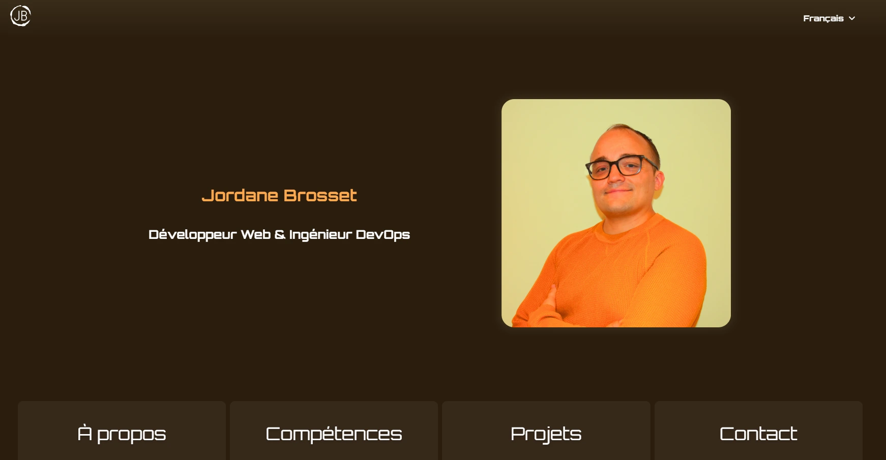

# Portfolio DevOps & Web - Jordane Brosset

<p align="center">
  
  
  
</p>

Ce projet est le portfolio personnel de **Jordane Brosset**, développé pour mettre en avant ses compétences en **développement web** (React, SCSS, i18n) et en **DevOps** (Docker, Ansible, Terraform, CI/CD).

Le site est **multilingue, responsive**, entièrement **dockerisé** et **déployé automatiquement sur AWS EC2** via GitHub Actions.

## Démo

👉 [Accéder au site en ligne](https://jordane-brosset.com)

<p align="center">
  <a href="https://jordane-brosset.com" target="_blank">
    
  </a>
</p>

## Fonctionnalités

-   **Frontend** : React (Vite), SCSS, i18n (français, anglais, espagnol), design responsive, transitions animées, présentation de projets.
-   **DevOps** : Frontend dockerisé, configuration Nginx, playbook Ansible pour le déploiement, et Terraform pour la gestion de l’infrastructure AWS.
-   **CI/CD** : Workflow GitHub Actions pour le déploiement automatisé sur AWS EC2.
-   **Monitoring** : Monitoring de l’application avec Prometheus et Grafana.

## Structure du projet

```
├── frontend/               # Application React (Vite, SCSS, i18n)
├── infra/
│   ├── ansible/            # Playbook & rôles Ansible pour le provisioning/déploiement
│   └── terraform/          # Scripts Terraform pour la création d’EC2 AWS
├── monitoring/             # Stack Prometheus, Grafana, exporters, dashboards, alerting
│   ├── grafana/
│   └── prometheus/
├── nginx/                  # Dockerfile et configuration Nginx (reverse-proxy, SSL)
├── docker-compose.yml      # Orchestration multi-conteneurs (frontend, nginx, etc.) pour l'environnement de production
├── docker-compose.test.yml # Orchestration multi-conteneurs (frontend, nginx, etc.) pour l'environnement de test
├── .github/                # Workflows GitHub Actions (CI/CD)
│   ├── cleanup.yml         # Workflow pour la maintenance des containers sur EC2
│   ├── deploy.yml          # Workflow pour déployer l'application en production ou en test
│   └── monitoring.yml      # Workflow pour la gestion de la stack monitoring
└── README.md
```

## CI/CD

### Déploiement manuel

- Le workflow [**deploy.yml**](.github/workflows/deploy.yml) est déclenché manuellement via l’option `workflow_dispatch` de GitHub Actions.
- Lors du déclenchement, l’utilisateur peut choisir l’environnement cible (`prod` pour la production ou `test` pour l’environnement de test).
- Ce workflow provisionne et déploie l’application sur **AWS EC2**, en utilisant **Ansible** et **Docker**.

### Maintenance des conteneurs

- Le workflow [**cleanup.yml**](.github/workflows/cleanup.yml) assure le nettoyage automatique des anciens conteneurs.
- Il libère de l’espace disque et garantit que seules les versions récentes de l’application sont actives.

### Gestion de la stack de monitoring

- Le workflow [**monitoring.yml**](.github/workflows/monitoring.yml) est déclenché à chaque push sur la branche `main` dans le dossier `monitoring/`.
- Il met à jour la stack de supervision, incluant les configurations de **Prometheus**, **Grafana**, des **exporters**, et des **dashboards personnalisés**.

## Auteur

[Jordane Brosset](https://github.com/Scarnee)  
Développeur Web & Ingénieur DevOps  
📧 jordane.brosset@gmail.com  
🌐 [jordane-brosset.com](https://jordane-brosset.com)

## Licence

Ce projet est un portfolio personnel, fourni à titre de démonstration.  
Toute réutilisation ou reproduction du code est interdite sans autorisation explicite de l’auteur.
